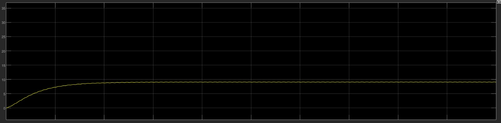
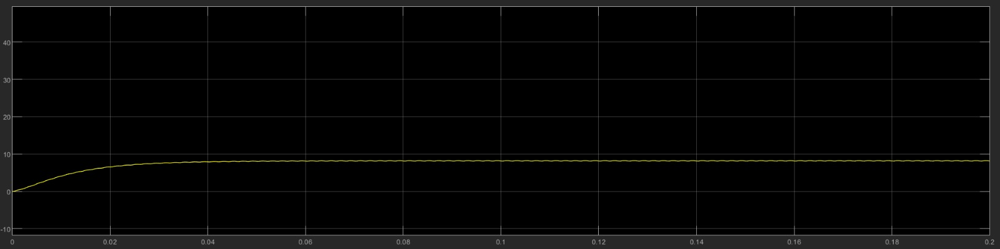

  
   
  <em></em>

Título: Parametros simulação 1 - conversor buck
Ref.: Eletrônica de Potência: Dispositivos, Circuitos e Aplicações. Muhammad H. Rashid (Autor)

### Resultados:

- circuito:

  
   
  <em></em>

- Parametrização capacitor
 
 $$ Capacitancia = Co = 0.0027F $$

 - Parametrização indutor

 $$ Indultancia = Lo = 0.0126H $$

 #### Sinais Pulse generator:

 #### Sinais de corrente na carga:

  
   
  <em></em>

 #### Sinais de tensão na carga:

  
   
  <em></em>

