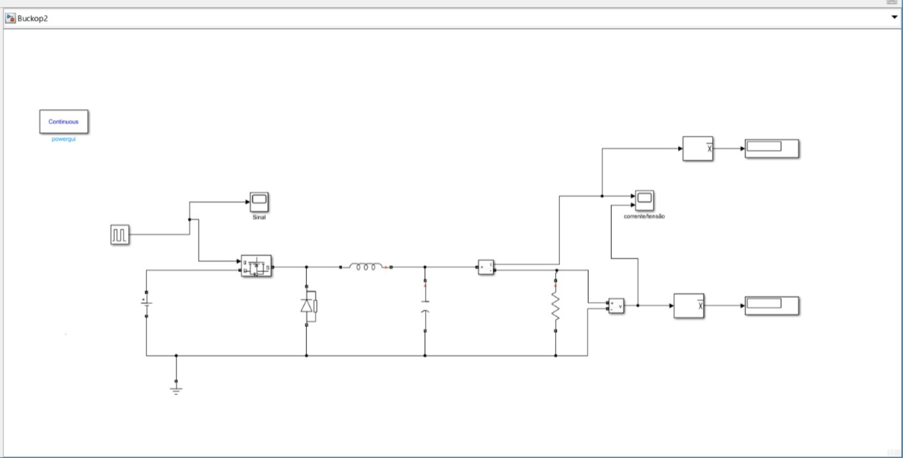

  
   
  <em></em>

Título: Parametros simulação 1 - conversor buck
Ref.: Eletrônica de Potência: Dispositivos, Circuitos e Aplicações. Muhammad H. Rashid (Autor)

### Resultados:

  
   
  <em></em>

